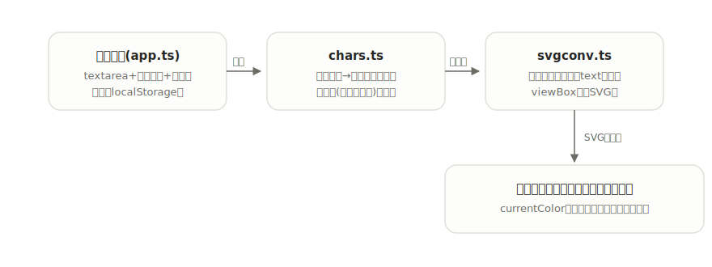

# keisen

[](https://github.com/miruky/keisen/actions/workflows/ci.yml)
[](https://github.com/miruky/keisen/actions/workflows/deploy.yml)

[](LICENSE)

**罫線文字でASCII図を描き、文字をそのまま線に変換したSVGとして書き出すエディタ。**

公開ページ: https://miruky.github.io/keisen/

## 概要

keisenは「┌─┐」のような罫線文字の図をブラウザで書くためのエディタである。等幅のテキストエディタとパレット(細線・太線の罫線文字)、箱・表・流れ図のひな形を備え、書いた図はリアルタイムでSVGに変換される。変換では罫線文字をフォントのグリフとしてではなく本物の線として引くため、拡大しても線の太さが揃い、フォントによって罫線が途切れる問題が起きない。出力は`currentColor`で描かれ、貼り付け先のライト・ダーク配色にそのまま追従する。

書きかけの本文はブラウザのlocalStorageに保存され、サーバーには何も送らない。

### なぜ作ったのか

罫線文字の図はテキストファイルやコメントの中では便利だが、ドキュメントに貼ると等幅フォントの都合で線が切れたりずれたりする。一方で作図ツールで描き直すのは大げさで、元のテキストとの二重管理になる。「テキストとして書き、図として貼る」を1つのエディタで済ませ、変換後も線がきれいなままであることを目的にした。

## アーキテクチャ



変換の中心は罫線文字の表(`chars.ts`)で、各文字を「セル中央から上下左右へ伸びる線分の組」として定義する。SVG変換(`svgconv.ts`)はこの表だけを頼りに線を引き、罫線以外の文字は`text`要素として中央に置く。どちらもDOMに依存しない純粋なモジュールで、そのまま単体テストできる。

## 技術スタック

| カテゴリ             | 技術                           |
| :------------------- | :----------------------------- |
| 言語                 | TypeScript 5(strict)           |
| ビルド               | Vite 6                         |
| テスト               | Vitest                         |
| リンタ・フォーマッタ | ESLint 9 / Prettier            |
| CI / 配信            | GitHub Actions / GitHub Pages  |
| 永続化               | localStorage(外部サービスなし) |

## 使い方

### 描く

エディタに直接書くか、パレットの罫線文字(細線11種・太線11種)をキャレット位置に挿入する。箱・表・流れ図のひな形から始めて書き換えるのが早い。

### SVG変換の規則

| 入力                        | 変換                         |
| :-------------------------- | :--------------------------- |
| 罫線文字(─│┌┐└┘├┤┬┴┼ など)  | セル中央から伸びる線(`path`) |
| 太線の罫線文字(━┃┏┓┗┛ など) | 太いストロークの線           |
| 空白(半角・全角)            | 何も置かずに進む             |
| その他の文字                | セル中央に置いた`text`       |

文字幅は罫線文字・全角文字を2桁、半角文字を1桁として数える。出力のSVGは`viewBox`付きで、線も文字も`currentColor`で描かれる。

```svg
<svg xmlns="http://www.w3.org/2000/svg" viewBox="0 0 60 60" role="img" aria-label="罫線図">
  <g fill="currentColor" font-family="ui-monospace, 'SF Mono', Menlo, monospace" font-size="14">
  <text x="30" y="30" text-anchor="middle" dominant-baseline="central">A</text>
  </g>
  <path d="M 10 10 V 20 M 10 10 H 20 ..." stroke="currentColor" stroke-width="1.5" fill="none" stroke-linecap="square"/>
</svg>
```

### 制約

- 対応する罫線文字は細線・太線の22種で、二重線(╔═╗)や角丸(╭╮)には対応しない。
- 文字幅の判定はEast Asian Widthの近似で、結合文字や絵文字幅は考慮しない。
- 持てる図は1枚だけ。複数の図を切り替える機能はない。

## プロジェクト構成

- `index.html` — エントリポイント
- `src/main.ts` — 起動
- `src/app.ts` — エディタ・パレット・プレビューの画面とイベント処理
- `src/icons.ts` — 線画SVGアイコン
- `src/style.css` — デザイントークンとスタイル(ライト・ダーク対応)
- `src/lib/chars.ts` — 罫線文字の線分表と文字幅の判定
- `src/lib/svgconv.ts` — テキストからSVGへの変換
- `docs/architecture.svg` — 構成図
- `.github/workflows/` — CI(lint・テスト・ビルド)とPagesデプロイ

## はじめ方

### 前提条件

- Node.js 22以上

### セットアップ

```bash
git clone https://github.com/miruky/keisen.git
cd keisen
npm install
npm run dev
```

### テストの実行

```bash
npm test
```

### Lintの実行

```bash
npm run lint
```

### ビルド

```bash
npm run build
```

GitHub Pagesではリポジトリ名のサブパスで配信されるため、デプロイ時は環境変数 `KEISEN_BASE=/keisen/` でViteの `base` を切り替える(`.github/workflows/deploy.yml` 参照)。

## 設計方針

- **グリフではなく線を引く** — 罫線文字をフォント任せで描くと、行間や書体で線が切れる。文字を線分の定義に引き直すことで、出力の見た目を入力環境から切り離した。
- **文字の表をデータとして持つ** — 罫線文字と線分の対応は1つの表で、変換ロジックは表を読むだけにした。対応文字を増やすときは表に1行足せばよい。
- **IMEを邪魔しない描画** — 本文の編集ではプレビューだけを差し替え、textareaを再生成しない。
- **貼り付け先に馴染む出力** — 線も文字も`currentColor`で描き、大きさはviewBoxに任せる。SVGを受け取った側が色と大きさを決められる。

## ライセンス

[MIT](LICENSE)
